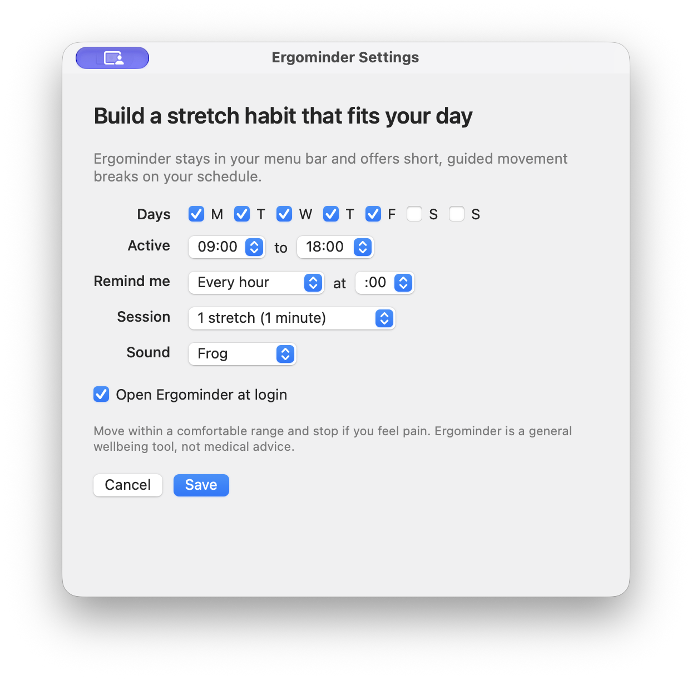

# Ergominder

Ergominder is a small macOS menu-bar app that reminds you to take short, guided stretch breaks. You choose the days, hours, frequency, sound, and number of stretches. Everything stays on your Mac.



## Download

[Download Ergominder 1.0.0 for Apple Silicon](https://github.com/cipshadow/ergominder/releases/download/v1.0.0/Ergominder-Install-v1.0.0.zip)

Requirements: an Apple Silicon Mac with macOS 13 Ventura or later. Intel Macs are not supported.

## Install

1. Download and unzip `Ergominder-Install-v1.0.0.zip`.
2. Double-click `Install Ergominder.command` once. macOS may block it.
3. Open **System Settings > Privacy & Security** and scroll to **Security**.
4. Click **Open Anyway** for `Install Ergominder.command`, enter your Mac password if asked, then confirm **Open**.
5. macOS may then block Ergominder itself. Return to **Privacy & Security**, click **Open Anyway** for Ergominder, and confirm **Open**.
6. Choose your reminder schedule and click **Save**.

Do not disable Gatekeeper. Apple explains this one-app exception in [Safely open apps on your Mac](https://support.apple.com/102445).

Ergominder is ad hoc signed because it is published without an Apple Developer Program membership. It is not notarized or verified by Apple, so macOS shows the warning above. Download it only from this repository.

## Use

After installation, look for the stretching figure in the menu bar. Its menu lets you:

- start a stretch session now;
- pause or resume reminders;
- see the next reminder;
- view local session counts;
- change your schedule;
- quit the app.

Enable **Start Ergominder at login** in Settings if you want it to launch automatically.

## Verify the download

The release includes `SHA256SUMS.txt`. To check that the ZIP downloaded without changing, put both files in the same folder and run:

```sh
cd /path/to/the/download/folder
shasum -a 256 -c SHA256SUMS.txt
```

The result should end with `OK`. The checksum detects a changed or incomplete download; it does not replace Apple's Developer ID and notarization checks.

## Privacy

Ergominder has no account, analytics, advertising, or network code. It stores your schedule, pause state, and simple yes/not-now/away counts in macOS preferences under `com.cipblujdea.ergominder`.

## Uninstall

1. Choose **Quit Ergominder** from its menu-bar menu.
2. In **System Settings > General > Login Items**, remove Ergominder if it appears.
3. Move `~/Applications/Ergominder.app` to the Trash.

To remove its settings and local counts too, run:

```sh
defaults delete com.cipblujdea.ergominder
```

## Source and license

Ergominder is proprietary software. This public repository contains release files, checksums, screenshots, and documentation only. The source code is not published. See [LICENSE](LICENSE).
